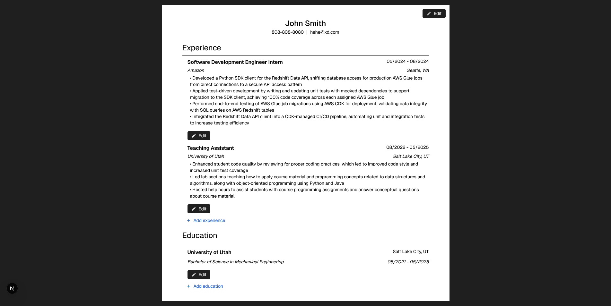

# CV Generator
This simple web application is a CV generator where users can input their general information, experience, and education to build a CV that is preformatted. 

By building this project, I learned how to create a React application with NextJS that uses Tailwind CSS to style React components. This project leverages
React features such as props, JSX, and state hooks to prefill form inputs that have data input by the user when they edit different components.

## Preview

## Credits
- Project Idea Credit: The Odin Project
